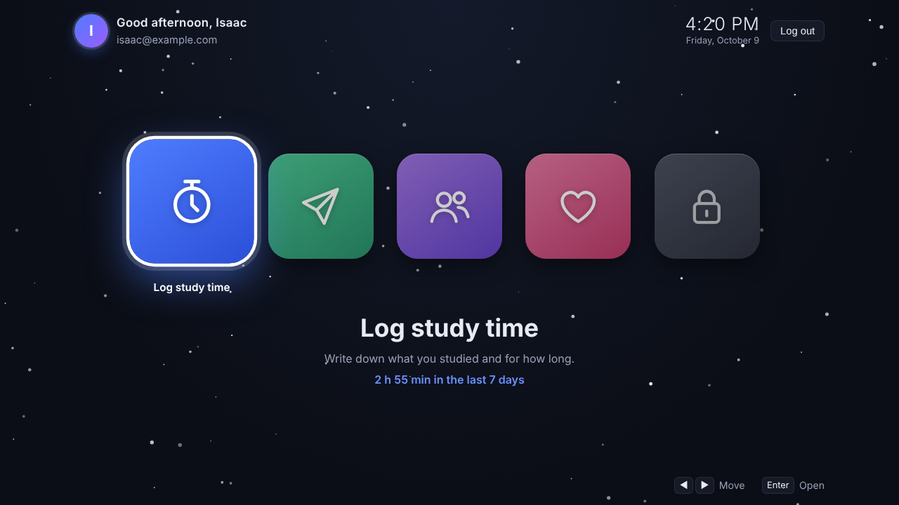
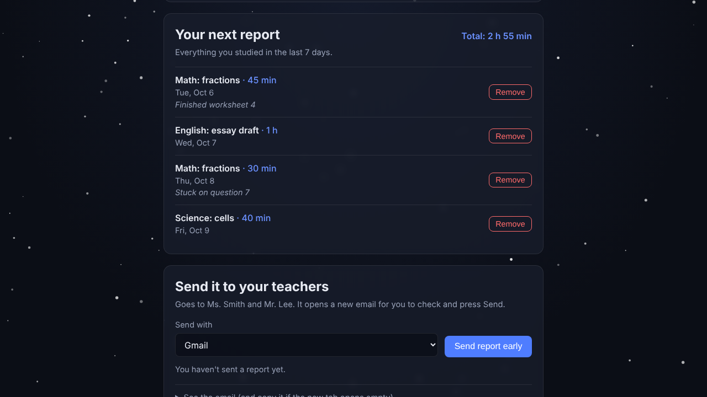
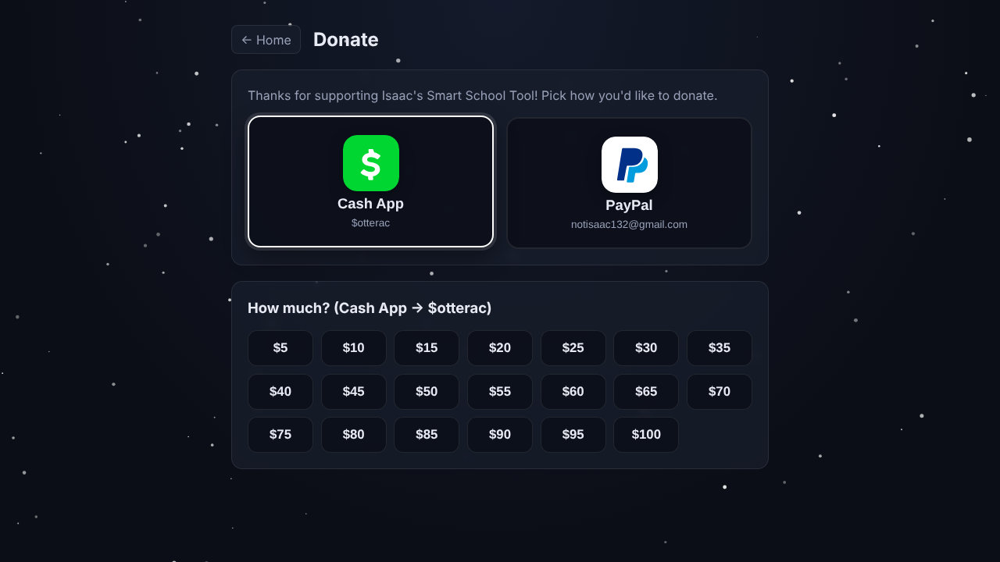

<div align="center">


# Isaac's Smart School Tool

**Log your study time and send your teachers a weekly report in one click.**

For **Chromebook**, **Windows** and **Mac** · Free · Updates itself

### [⬇ Get the app](https://notisaac132-star.github.io/Isaac-s-Smart-School-Tool/)



</div>

## Download

| Computer | Get it |
| --- | --- |
| 💻 **Chromebook** | [**Open & install**](https://notisaac132-star.github.io/Isaac-s-Smart-School-Tool/app/), then click **⬇ Install app** |
| 🪟 **Windows** | [**Installer (.exe)**](https://github.com/notisaac132-star/Isaac-s-Smart-School-Tool/releases/latest/download/Smart-School-Tool-Windows-Setup.exe) · [Portable, no install (.exe)](https://github.com/notisaac132-star/Isaac-s-Smart-School-Tool/releases/latest/download/Smart-School-Tool-Windows-Portable.exe) |
| 🍎 **Mac** | [**Mac app (.dmg)**](https://github.com/notisaac132-star/Isaac-s-Smart-School-Tool/releases/latest/download/Smart-School-Tool-Mac.dmg) (Apple Silicon and Intel) |

Not sure which? The [download page](https://notisaac132-star.github.io/Isaac-s-Smart-School-Tool/) picks the right one for your computer.

## What it does

- 🎮 **Console-style home screen.** Big app icons you move through with the arrow keys, mouse, touch or a game controller, on a dark background with falling white dots.
- ⏱️ **Log study time.** What you studied, how long, which day, and a note for your teacher.
- ✈️ **Send your weekly report.** One click opens an email (Proton Mail, Gmail, Outlook or your email app) with your study time per subject, each session and the total, already addressed to your teachers. Send it on Sunday or **early** any day; the next report only includes what's new.
- 👥 **Teachers & tutors.** Add as many as you like and choose who gets the report.
- 🔐 **Your own account.** Sign up with email and password; everything follows you to any computer you log in on.
- 💖 **Donate.** Support the project with Cash App or PayPal.
- 🔄 **Always up to date.** Every version updates itself.

<table>
  <tr>
    <td></td>
    <td></td>
  </tr>
</table>

## Installing

<details>
<summary><b>💻 Chromebook</b></summary>

1. Open **https://notisaac132-star.github.io/Isaac-s-Smart-School-Tool/app/** in Chrome.
2. Click **⬇ Install app** at the bottom of the screen, or the install icon at the right end of the address bar.
3. It's now in your launcher with its own window.

School Chromebook won't let you install apps? It works in a normal Chrome tab too. Just bookmark it.
</details>

<details>
<summary><b>🪟 Windows: "Windows protected your PC"</b></summary>

Click **More info**, then **Run anyway**. Windows shows this for apps that aren't signed with a paid certificate.
</details>

<details>
<summary><b>🍎 Mac: "Apple could not verify…"</b></summary>

macOS blocks apps that aren't registered with Apple. You only have to allow it **once**:

1. Drag **Smart School Tool** from the .dmg into **Applications**, then double-click it.
2. When the warning appears, click **Done** (not "Move to Trash").
3. Go to **Apple menu → System Settings → Privacy & Security**, scroll to **Security**, and click **Open Anyway**.

No **Open Anyway** button? Open **Terminal** and run:

```sh
xattr -dr com.apple.quarantine "/Applications/Smart School Tool.app"
```

This only unblocks this one app. You don't need "Allow apps from anywhere".
</details>

## Updates

| | How it updates |
| --- | --- |
| **Chromebook** | Loads the newest version every time it opens. Nothing to download. |
| **Windows (installer) & Mac** | Downloads updates by itself and asks you to restart. |
| **Windows portable** | Tells you a new version is out and opens the download. |

The version number is in the window title (Windows/Mac) or the bottom-left of the home screen (Chromebook).

## For developers

```
src/         the app itself, shared by every version
chromebook/  Chromebook (installable web app) files
windows/     Windows build settings
mac/         Mac build settings
download/    download page and password-reset page (GitHub Pages)
supabase/    database setup for accounts (schema.sql)
docs/        screenshots for this page
```

Every push to `main` builds the Windows and Mac apps and publishes them as the latest release, and publishes the
Chromebook app and download page to GitHub Pages (`.github/workflows/build-apps.yml`). Accounts and data use
[Supabase](https://supabase.com); each account can only see its own data (row level security in `supabase/schema.sql`).

```sh
npm install
npm start                                  # run the desktop app
npm run build:windows                      # Windows .exe files (run on Windows)
npm run build:mac                          # Mac .dmg (run on a Mac)
sh chromebook/build.sh out/app 1.0.0       # Chromebook app into out/app
```
